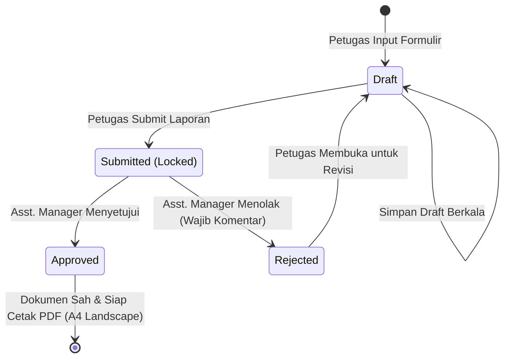

# 📑 DOKUMEN HANDOVER & PRODUCT REQUIREMENT DOCUMENT (PRD)
## SISTEM INFORMASI DIGITALISASI MONITORING CCTV — PT KERETA API INDONESIA (PERSERO)

> **Dokumen Resmi Arsitektur, Kebutuhan Produk (PRD), Struktur Tim & Panduan Handover Pengembang**  
> **Nomor Dokumen Acuan Formulir**: `FR.SM/TI/015.017/10-2020`  
> **Klasifikasi Dokumen**: TERBATAS  
> **Tanggal Pembaruan**: September 2026  
> **Status Sistem**: Production Ready (Fullstack React.js + Express.js + MySQL + Puppeteer PDF Engine)  
> **Repositori GitHub**: [https://github.com/novaldtym/KAI_Sistem-Monitoring-CCTV.git](https://github.com/novaldtym/KAI_Sistem-Monitoring-CCTV.git)

---

## 📌 DAFTAR ISI
1. [Ringkasan Eksekutif & Latar Belakang](#1-ringkasan-eksekutif--latar-belakang)
2. [Product Requirement Document (PRD)](#2-product-requirement-document-prd)
   - [2.1 Tujuan Produk & Success Metrics](#21-tujuan-produk--success-metrics)
   - [2.2 User Personas & Role-Based Access Control (RBAC)](#22-user-personas--role-based-access-control-rbac)
   - [2.3 Spesifikasi Kebutuhan Fungsional (FR)](#23-spesifikasi-kebutuhan-fungsional-fr)
   - [2.4 Spesifikasi Kebutuhan Non-Fungsional (NFR)](#24-spesifikasi-kebutuhan-non-fungsional-nfr)
   - [2.5 Alur Kerja Bisnis & State Machine](#25-alur-kerja-bisnis--state-machine)
3. [Tim Pengembang & Pembagian Peran (5 Anggota)](#3-tim-pengembang--pembagian-peran-5-anggota)
   - [3.1 Profil & Tanggung Jawab Anggota Tim](#31-profil--tanggung-jawab-anggota-tim)
   - [3.2 Matriks Tanggung Jawab (RACI Matrix)](#32-matriks-tanggung-jawab-raci-matrix)
4. [Arsitektur Sistem & Tech Stack](#4-arsitektur-sistem--tech-stack)
5. [Skema Database & Kamus Data (MySQL 8.0)](#5-skema-database--kamus-data-mysql-80)
6. [Spesifikasi RESTful API Endpoints](#6-spesifikasi-restful-api-endpoints)
7. [Struktur Repositori & File Kunci](#7-struktur-repositori--file-kunci)
8. [Akun Pengujian Bawaan (Default Seeded Users)](#8-akun-pengujian-bawaan-default-seeded-users)
9. [Panduan Instalasi & Menjalankan Aplikasi](#9-panduan-instalasi--menjalankan-aplikasi)
10. [Catatan Teknis, Solusi Kendala & Riwayat Perubahan](#10-catatan-teknis-solusi-kendala--riwayat-perubahan)

---

## 1. Ringkasan Eksekutif & Latar Belakang

PT Kereta Api Indonesia (Persero) memiliki prosedur operasional standar pemeriksaan CCTV secara berkala di seluruh stasiun untuk menjamin keselamatan operasional perkeretaapian dan keamanan fasilitas umum. Selama ini, pencatatan monitoring mingguan (Minggu ke-1 hingga Minggu ke-4) dilakukan secara manual menggunakan formulir kertas berkode dokumen **`FR.SM/TI/015.017/10-2020`** (Revisi Versi 002-2020 tertanggal 12 Oktober 2020).

### Tantangan Sistem Manual Sebelumnya:
1. **Risiko Kehilangan & Kerusakan Fisik**: Formulir kertas berisiko sobek, basah, atau terselip di lingkungan stasiun.
2. **Keterlambatan Approval Hirarkis**: Petugas IT Support harus membawa berkas fisik secara manual ke Assistant Manager IT Support 1 untuk mendapatkan tanda tangan basah.
3. **Ketiadaan Rekapitulasi Real-Time**: Manajemen unit IT kesulitan memantau stasiun mana saja yang belum atau sudah mengirimkan laporan pada bulan berjalan.
4. **Duplikasi Data & Kerapuhan Riwayat**: Data evaluasi berkala sulit dicari ulang ketika terjadi insiden investigasi keamanan.

### Solusi Sistem Digital:
Sistem Informasi Digitalisasi Monitoring CCTV KAI menghadirkan platform berbasis web modern yang mendigitalkan seluruh siklus input, validasi otomatis, workflow approval bertingkat, serta menghasilkan dokumen PDF legalitas formal berukuran **A4 Landscape** dengan tingkat presisi dan tata letak identik 100% dengan lembar formulir fisik resmi KAI.

---

## 2. Product Requirement Document (PRD)

### 2.1 Tujuan Produk & Success Metrics

| Kategori | Target Kinerja | Parameter Keberhasilan |
| :--- | :--- | :--- |
| **Kecepatan Pelaporan** | Pemangkasan siklus review | Waktu approval berkurang dari 3-5 hari kerja menjadi < 1 hari. |
| **Kepatuhan Monitoring** | 100% stasiun terlapor tepat waktu | Notifikasi/alert stasiun yang belum lapor di dashboard per bulan berjalan. |
| **Integritas Dokumen** | Output cetak standar baku | Dokumen PDF ter-generate otomatis berstandar KAI (A4 Landscape, logo resmi, klasifikasi TERBATAS). |
| **Integritas Database** | Mencegah duplikasi data | Constraint unik database `[station_id, bulan, tahun]` menjamin 1 stasiun hanya memiliki 1 laporan valid per periode. |

---

### 2.2 User Personas & Role-Based Access Control (RBAC)

Sistem menerapkan RBAC ketat berbasis NIPP (Nomor Induk Pegawai Perusahaan):

| Modul / Kemampuan | Petugas IT Support (`petugas`) | Assistant Manager IT Support 1 (`assistant_manager`) |
| :--- | :---: | :---: |
| **Login via NIPP & Password** | ✓ | ✓ |
| **Melihat Dashboard Ringkasan & Status Periode** | ✓ (Khusus miliknya) | ✓ (Semua Stasiun) |
| **Input Formulir Monitoring Baru (M1 - M4)** | ✓ | ✗ |
| **Simpan Draft Monitoring** | ✓ | ✗ |
| **Edit Laporan (Hanya status `draft` & `rejected`)** | ✓ (Hanya milik sendiri) | ✗ |
| **Submit Laporan ke Atasan** | ✓ | ✗ |
| **Melihat Seluruh Daftar Laporan & Riwayat Approval** | ✓ (Milik sendiri) | ✓ (Semua Stasiun) |
| **Halaman Review & Antrean Approval Masuk** | ✗ | ✓ |
| **Approve Laporan (dengan catatan opsional)** | ✗ | ✓ |
| **Reject Laporan (dengan catatan alasan wajib)** | ✗ | ✓ |
| **Unduh / Cetak Dokumen PDF Resmi KAI** | ✓ (Status apapun) | ✓ (Status apapun) |
| **Master Data: Stasiun & Business Area (CRUD)** | ✗ | ✓ |
| **Master Data: Titik CCTV per Stasiun (CRUD)** | ✗ | ✓ |

---

### 2.3 Spesifikasi Kebutuhan Fungsional (FR)

#### FR-01: Autentikasi & Pengelolaan Sesi
- Pengguna masuk menggunakan NIPP resmi dan password.
- Sistem menerbitkan JSON Web Token (JWT) yang disimpan di `localStorage`.
- Router frontend membatasi akses URL berdasarkan peran yang diizinkan (`allowedRoles`).
- Logout menghapus token dan mengalihkan pengguna ke halaman login.

#### FR-02: Dashboard Analitik & Monitoring Kepatuhan
- Menampilkan kartu ringkasan jumlah: **Draft**, **Submitted**, **Approved**, dan **Rejected**.
- Khusus akun Assistant Manager: Menampilkan daftar stasiun aktif yang **belum menyerahkan laporan** pada bulan & tahun berjalan (*Unreported Stations*).
- Menampilkan indikator angka *Pending Review* pada navigasi menu Assistant Manager.

#### FR-03: Matriks Pemeriksaan CCTV Mingguan (M1 - M4)
- Otomatis memuat daftar seluruh titik CCTV aktif berdasarkan stasiun yang dipilih secara berurutan sesuai `nomor_urut`.
- Terdapat 4 periode mingguan (M1, M2, M3, M4) dengan input tanggal pelaksanaan masing-masing.
- Setiap titik CCTV memiliki 2 kolom status per minggu:
  1. **BERFUNGSI**: Pemeriksaan visual apakah kamera aktif dan menampilkan gambar jernih.
  2. **TERBACKUP**: Pemeriksaan apakah rekaman tersimpan dengan baik di Network Video Recorder (NVR/DVR).
- Interaksi tombol toggle 1-klik tri-state:
  - `✓` (Centang Hijau): Berfungsi / Terbackup (Nilai database: `'V'`).
  - `X` (Silang Merah): Rusak / Tidak Terbackup (Nilai database: `'X'`).
  - `-` (Netral Abu-abu): Belum diperiksa / Kosong (Nilai database: `'-'`).
- Kolom teks area untuk catatan teknis kendala di lapangan (misal: kabel putus, storage penuh, adaptor rusak).

#### FR-04: Workflow Approval & State Machine Laporan
- **Status `draft`**: Laporan disimpan sementara oleh Petugas, dapat disunting sewaktu-waktu.
- **Status `submitted`**: Laporan dikirimkan ke Assistant Manager, data dikunci (*read-only*) dari sisi Petugas.
- **Status `approved`**: Laporan disetujui Assistant Manager, log pencatatan masuk ke audit trail, siap dicetak sebagai dokumen legal.
- **Status `rejected`**: Laporan ditolak oleh Assistant Manager dengan **kewajiban mengisi alasan/komentar penolakan**. Laporan kembali berstatus editable oleh Petugas untuk dilakukan revisi, kemudian dapat di-submit ulang.

#### FR-05: Audit Trail & Riwayat Approval
- Sistem merekam riwayat setiap aksi persetujuan atau penolakan ke tabel `approval_logs`.
- Merekam ID Approver, nama, NIPP, tindakan (`approved` atau `rejected`), komentar revisi, dan timestamp waktu aksi.

#### FR-06: Engine Generator Dokumen PDF Presisi Tinggi
- Menggunakan Puppeteer Headless Chromium untuk merender template HTML/Handlebars ke format file PDF asli `%PDF-1.4`.
- **Standar Format KAI**:
  - Orientasi: **A4 Landscape** (`size: A4 landscape; margin: 5mm 8mm 5mm 8mm;`).
  - Header Dokumen: Logo resmi KAI (WebP Base64), badge pembatas bertuliskan `TERBATAS`, unit *Sistem Informasi*, dan judul formulir.
  - Sub-table Metadata: No Ref, Tanggal, Business Area (misal: B060), serta Nama Stasiun di sisi kanan atas.
  - Matriks Tabel Pemantauan: No, Nama Titik CCTV, Bulan Pelaksanaan, M1-M4 (Tanggal Pelaksanaan + Sub-kolom BERFUNGSI & TERBACKUP), serta kolom Catatan/Note.
  - Box Catatan Khusus di bawah tabel.
  - Keterangan Simbol Legenda: `V : YA`, `X : TIDAK`.
  - Blok Tanda Tangan Berdampingan: Tanda Tangan Mengetahui (*Assistant Manager IT Support 1*) lengkap dengan NIPP, dan Tanda Tangan Pelaksana (*Petugas*) lengkap dengan NIPP.
- Mekanisme fallback otomatis engine PDF pada sistem operasi Windows: mendeteksi Google Chrome (`chrome.exe`) dan Microsoft Edge (`msedge.exe`).

#### FR-07: Pengelolaan Master Data Stasiun & Titik CCTV
- **Master Stasiun**: Pengelolaan nama stasiun, Business Area (misal: B060), kode stasiun (misal: LPN), dan status keaktifan.
- **Master Titik CCTV**: Penambahan dan pengeditan titik kamera per stasiun lengkap dengan nomor urut tata letak kamera.

---

### 2.4 Spesifikasi Kebutuhan Non-Fungsional (NFR)

1. **Desain & Pengalaman Pengguna (UI/UX)**:
   - Mengusung **Clean KAI Corporate Light Theme** (`#f8fafc` background utama, `#ffffff` card surface, aksen resmi KAI `#0d2c6c` Biru Tua & `#f36f21` Oranye KAI).
   - Tipografi standar korporat menggunakan font *Inter* dari Google Fonts.
   - Status badge dengan kontras warna teruji (Success hijau muda, Warning kuning, Danger merah, Info biru muda).
2. **Keamanan (Security)**:
   - Password dienkripsi satu arah menggunakan algoritma `bcryptjs` dengan *salt rounds* standar industri.
   - Otorisasi request via HTTP Header `Authorization: Bearer <token>`.
   - Pencegahan serangan web standar menggunakan middleware `helmet` dan proteksi `cors`.
   - Sanitasi input dan proteksi SQL Injection secara native oleh ORM Sequelize.
3. **Integritas Data (Data Consistency)**:
   - Composite unique key di database:
     - `uq_report_period`: Mencegah pembuatan lebih dari 1 laporan untuk stasiun yang sama pada kombinasi bulan & tahun yang sama.
     - `uq_detail`: Mencegah entri ganda untuk titik CCTV yang sama dalam satu laporan.
4. **Kompatibilitas & Portabilitas**:
   - Backend berbasis Node.js cross-platform yang dapat berjalan di Windows Server, Linux VPS, ataupun container Docker.

---

### 2.5 Alur Kerja Bisnis & State Machine



---

## 3. Tim Pengembang & Pembagian Peran (5 Anggota)

Proyek sistem informasi monitoring CCTV ini dirancang dan dikembangkan secara kolaboratif oleh tim yang terdiri dari **5 orang pengembang**, dengan spesialisasi peran, fokus area, dan tanggung jawab yang terbagi secara terstruktur:

### 3.1 Profil & Tanggung Jawab Anggota Tim

```text
┌────────────────────────────────────────────────────────────────────────┐
│               TIM PENGEMBANG MONITORING CCTV PT KAI                    │
├──────────────┬──────────────────────────────────┬──────────────────────┤
│ Nama Anggota │ Peran Utama                      │ Fokus Area Teknis    │
├──────────────┼──────────────────────────────────┼──────────────────────┤
│ Nouval       │ Project Leader & Fullstack Lead  │ Arsitektur & Keamanan│
│ Bagas        │ Frontend Developer & UI/UX       │ Antarmuka & Tema KAI │
│ Galih        │ Backend Developer & API Engineer │ REST API & Workflow  │
│ Putra        │ Database Administrator (DBA)     │ MySQL, ERD & Seeder  │
│ Ali          │ Reporting Engine & QA Specialist │ PDF Engine & Dokumen │
└──────────────┴──────────────────────────────────┴──────────────────────┘
```

#### 1. Nouval — Project Leader & Fullstack / Security Lead
- **Deskripsi Peran**: Penanggung jawab utama siklus hidup proyek (*End-to-End Delivery*), kepemimpinan tim, serta perancangan arsitektur sistem menyeluruh.
- **Tanggung Jawab Teknis**:
  - Mengorkestrasi arsitektur sistem secara menyeluruh dari sisi klien hingga server.
  - Merancang dan mengimplementasikan sistem autentikasi berbasis JSON Web Token (JWT) serta pengelolaan sesi pengguna.
  - Mengembangkan middleware otorisasi berbasis peran (*Role-Based Access Control / RBAC*) pada level route dan komponen guard frontend.
  - Memimpin integrasi antar-layer (Frontend SPA ke Backend REST API).
  - Mengelola repositori GitHub, alur percabangan (*Git branching*), *code review*, dan persiapan *deployment handover*.

#### 2. Bagas — Frontend Developer & UI/UX Specialist
- **Deskripsi Peran**: Penanggung jawab desain interaksi antarmuka pengguna, konsistensi visual korporat KAI, dan performa aplikasi di sisi peramban (*client-side*).
- **Tanggung Jawab Teknis**:
  - Mengembangkan aplikasi Single Page Application (SPA) berbasis React.js 18 dan Vite.
  - Mengimplementasikan sistem desain **Clean KAI Corporate Light Theme** menggunakan Vanilla CSS Design Tokens (palet `#0d2c6c` Deep Blue & `#f36f21` Signature Orange).
  - Membangun komponen interaktif matriks pemeriksaan mingguan (M1-M4) dengan tombol status `StatusToggle` tri-state (`✓`, `X`, `-`).
  - Mengembangkan tata letak halaman responsif, navigasi dinamis dengan `ProtectedRoute`, dan sistem notifikasi interaktif (*React Hot Toast*).

#### 3. Galih — Backend Developer & REST API Engineer
- **Deskripsi Peran**: Penanggung jawab logika bisnis server, pemrosesan transaksi, serta penyediaan antarmuka data RESTful API yang aman dan andal.
- **Tanggung Jawab Teknis**:
  - Membangun RESTful API menggunakan Express.js dan Node.js.
  - Mengembangkan controller inti: pengelolaan laporan (`reportController`), agregasi analitik dashboard kepatuhan (`dashboardController`), dan master data stasiun serta CCTV.
  - Mengimplementasikan alur logika persetujuan bertingkat (*Approval & Rejection Workflow with Mandatory Feedback*).
  - Mengonfigurasi middleware keamanan server (*Helmet*, *CORS*), validasi parameter request, dan penanganan kesalahan terpusat (*Centralized Error Handler*).

#### 4. Putra — Database Administrator (DBA) & Data Modeler
- **Deskripsi Peran**: Penanggung jawab integritas data, efisiensi skema database relasional, dan konsistensi persistensi data operasional.
- **Tanggung Jawab Teknis**:
  - Merancang Entity Relationship Diagram (ERD) dan skema fisik 6 tabel relasional di MySQL 8.0.
  - Mengonfigurasi pemodelan objek ORM Sequelize (relasi `hasMany`, `belongsTo`, foreign keys, cascade delete constraints).
  - Menetapkan indeks unik database (`uq_report_period` dan `uq_detail`) untuk mencegah anomali dan duplikasi laporan per periode stasiun.
  - Menyusun dan menguji skrip otomatisasi seeder data awal (`seed.js`) untuk Stasiun Lempuyangan, 20 titik CCTV resmi, dan kredensial akun kedinasan.

#### 5. Ali — Reporting Engine Specialist & QA / Technical Documenter
- **Deskripsi Peran**: Penanggung jawab modul cetak dokumen legalitas formal KAI, penjaminan kualitas aplikasi, dan kelengkapan dokumentasi proyek.
- **Tanggung Jawab Teknis**:
  - Mengembangkan *PDF Generator Engine* berbasis Puppeteer Headless Chromium dan Handlebars template.
  - Mereplikasi tata letak formulir fisik resmi KAI `FR.SM/TI/015.017/10-2020` ke dalam format **A4 Landscape** dengan akurasi dimensi 100% presisi.
  - Merancang mekanisme *browser auto-detection fallback* (Google Chrome & Microsoft Edge pada sistem operasi Windows).
  - Menjalankan pengujian fungsional menyeluruh (*End-to-End / Quality Assurance*) terhadap semua skenario alur kerja Petugas dan Assistant Manager.
  - Menyusun Product Requirement Document (PRD), petunjuk penggunaan (README), dan panduan teknis Handover.

---

### 3.2 Matriks Tanggung Jawab (RACI Matrix)

Matriks RACI mendefinisikan akuntabilitas tim pada setiap modul utama sistem:
- **R (Responsible)**: Pelaksana teknis pengerjaan modul.
- **A (Accountable)**: Penanggung jawab akhir dan pengambil keputusan modul.
- **C (Consulted)**: Pihak yang dimintai masukan teknis dua arah.
- **I (Informed)**: Pihak yang menerima laporan kemajuan modul.

| Modul & Deliverable Sistem | Nouval | Bagas | Galih | Putra | Ali |
| :--- | :---: | :---: | :---: | :---: | :---: |
| **Arsitektur Sistem & Manajemen Repositori Git** | **A / R** | I | C | C | I |
| **Autentikasi JWT & Otorisasi RBAC Middleware** | **A / R** | C | C | C | I |
| **Antarmuka SPA & Clean KAI Corporate Theme** | C | **A / R** | I | I | C |
| **Komponen Interaktif Matriks Form M1-M4** | C | **A / R** | C | I | I |
| **RESTful API Services & Business Controllers** | C | I | **A / R** | C | I |
| **Workflow State Machine (Approval / Rejection)**| C | C | **A / R** | C | I |
| **Perancangan Skema Database MySQL & ORM** | C | I | C | **A / R** | I |
| **Integritas Relasi Data, Indexing & Data Seeder**| C | I | C | **A / R** | I |
| **Engine PDF Generator Puppeteer (A4 Landscape)** | C | I | C | I | **A / R** |
| **Testing, Quality Assurance & Bug Fixing** | C | C | C | C | **A / R** |
| **Penyusunan PRD Resmi & Panduan Handover** | **A** | C | C | C | **R** |

---

## 4. Arsitektur Sistem & Tech Stack

```text
┌─────────────────────────────────────────────────────────────┐
│                    CLIENT (BROWSER SPA)                     │
│  React.js 18 + Vite | React Router v6 | Vanilla CSS System │
│     KAI Corporate Light Theme | React Hot Toast & Icons     │
└──────────────────────────────┬──────────────────────────────┘
                               │ HTTP / REST API (JWT Bearer)
                               ▼
┌─────────────────────────────────────────────────────────────┐
│                 BACKEND REST API (NODE.JS)                  │
│       Express.js | Sequelize ORM | JWT Auth | Bcrypt        │
└──────────────┬──────────────────────────────┬───────────────┘
               │                              │
               ▼                              ▼
┌─────────────────────────────┐  ┌────────────────────────────┐
│      DATABASE (MYSQL)       │  │    PDF GENERATOR ENGINE    │
│       monitoring_cctv       │  │ Puppeteer + Handlebars     │
│   (6 Relational Tables)     │  │ Output: A4 Landscape PDF   │
└─────────────────────────────┘  └────────────────────────────┘
```

- **Frontend Tech Stack**:
  - Library: **React.js 18.2**
  - Build Tool: **Vite 5**
  - Routing: **React Router DOM v6** (Protected Route Middleware)
  - HTTP Client: **Axios** (dengan request interceptor token)
  - Desain & Styling: **Vanilla CSS 3** (Design tokens variables, light mode, responsive flexbox & grid)
  - Notifikasi: **React Hot Toast**
  - Iconography: **React Icons (Feather Icons)**
- **Backend Tech Stack**:
  - Runtime: **Node.js (v20 / v22)**
  - Web Framework: **Express.js 4**
  - Database Driver & ORM: **Sequelize ORM** + `mysql2`
  - Keamanan: **JSONWebToken (JWT)**, **bcryptjs**, **helmet**, **cors**
  - Templating: **Handlebars**
  - PDF Renderer: **Puppeteer** (Headless Chromium)
- **Database Engine**:
  - **MySQL 8.0** / MariaDB 10.4+

---

## 5. Skema Database & Kamus Data (MySQL 8.0)

Nama Database: `monitoring_cctv`

### 1. Tabel `users`
Menyimpan akun pengguna, hak akses, dan NIPP pegawai KAI.

| Nama Kolom | Tipe Data | Keterangan / Constraint |
| :--- | :--- | :--- |
| `id` | INT AUTO_INCREMENT | Primary Key |
| `nipp` | VARCHAR(20) | Unique, Not Null (NIPP Pegawai KAI) |
| `nama` | VARCHAR(100) | Not Null (Nama Lengkap Pegawai) |
| `email` | VARCHAR(100) | Unique, Not Null |
| `password_hash` | VARCHAR(255) | Not Null (Hash Bcrypt) |
| `role` | ENUM('petugas', 'assistant_manager') | Not Null, Default: 'petugas' |
| `jabatan` | VARCHAR(100) | Nama Jabatan Resmi Kedinasan |
| `created_at` / `updated_at` | DATETIME | Timestamp pencatatan sistem |

### 2. Tabel `stations`
Daftar stasiun kereta api dan business area operasional.

| Nama Kolom | Tipe Data | Keterangan / Constraint |
| :--- | :--- | :--- |
| `id` | INT AUTO_INCREMENT | Primary Key |
| `nama_stasiun` | VARCHAR(100) | Not Null (Contoh: "Stasiun Lempuyangan") |
| `business_area` | VARCHAR(20) | Not Null (Contoh: "B060") |
| `kode_stasiun` | VARCHAR(10) | Unique, Not Null (Contoh: "LPN") |
| `is_active` | BOOLEAN | Default: true |
| `created_at` / `updated_at` | DATETIME | Timestamp |

### 3. Tabel `cctv_points`
Daftar titik lokasi kamera CCTV yang terpasang di stasiun.

| Nama Kolom | Tipe Data | Keterangan / Constraint |
| :--- | :--- | :--- |
| `id` | INT AUTO_INCREMENT | Primary Key |
| `station_id` | INT | Foreign Key -> `stations(id)` |
| `nomor_urut` | INT | Not Null (Urutan titik kamera pada tabel) |
| `nama_titik` | VARCHAR(150) | Not Null (Contoh: "LPN - Ruang Server") |
| `is_active` | BOOLEAN | Default: true |
| `created_at` / `updated_at` | DATETIME | Timestamp |

### 4. Tabel `monitoring_reports`
Header dokumen laporan monitoring bulanan stasiun.

| Nama Kolom | Tipe Data | Keterangan / Constraint |
| :--- | :--- | :--- |
| `id` | INT AUTO_INCREMENT | Primary Key |
| `station_id` | INT | Foreign Key -> `stations(id)` |
| `bulan` | TINYINT | Not Null (1 - 12) |
| `tahun` | SMALLINT | Not Null (Contoh: 2026) |
| `no_ref` | VARCHAR(20) | Nomor Referensi Dokumen Internal |
| `tanggal_m1` | DATE | Tanggal pelaksanaan pemeriksaan minggu ke-1 |
| `tanggal_m2` | DATE | Tanggal pelaksanaan pemeriksaan minggu ke-2 |
| `tanggal_m3` | DATE | Tanggal pelaksanaan pemeriksaan minggu ke-3 |
| `tanggal_m4` | DATE | Tanggal pelaksanaan pemeriksaan minggu ke-4 |
| `catatan` | TEXT | Catatan teknis pemeriksaan CCTV |
| `status` | ENUM('draft', 'submitted', 'approved', 'rejected') | Default: 'draft' |
| `created_by` | INT | Foreign Key -> `users(id)` (Petugas pembuat) |
| **Index Unik** | `uq_report_period` | UNIQUE (`station_id`, `bulan`, `tahun`) |

### 5. Tabel `monitoring_details`
Detail status pemeriksaan titik CCTV per minggu (M1 - M4).

| Nama Kolom | Tipe Data | Keterangan / Constraint |
| :--- | :--- | :--- |
| `id` | INT AUTO_INCREMENT | Primary Key |
| `report_id` | INT | Foreign Key -> `monitoring_reports(id)` (CASCADE DELETE) |
| `cctv_point_id` | INT | Foreign Key -> `cctv_points(id)` |
| `m1_berfungsi` | ENUM('V', 'X', '-') | Default: '-' |
| `m1_terbackup` | ENUM('V', 'X', '-') | Default: '-' |
| `m2_berfungsi` | ENUM('V', 'X', '-') | Default: '-' |
| `m2_terbackup` | ENUM('V', 'X', '-') | Default: '-' |
| `m3_berfungsi` | ENUM('V', 'X', '-') | Default: '-' |
| `m3_terbackup` | ENUM('V', 'X', '-') | Default: '-' |
| `m4_berfungsi` | ENUM('V', 'X', '-') | Default: '-' |
| `m4_terbackup` | ENUM('V', 'X', '-') | Default: '-' |
| **Index Unik** | `uq_detail` | UNIQUE (`report_id`, `cctv_point_id`) |

### 6. Tabel `approval_logs`
Catatan riwayat persetujuan atau penolakan laporan.

| Nama Kolom | Tipe Data | Keterangan / Constraint |
| :--- | :--- | :--- |
| `id` | INT AUTO_INCREMENT | Primary Key |
| `report_id` | INT | Foreign Key -> `monitoring_reports(id)` |
| `approved_by` | INT | Foreign Key -> `users(id)` (Assistant Manager) |
| `action` | ENUM('approved', 'rejected') | Not Null |
| `komentar` | TEXT | Catatan / Alasan penolakan dari atasan |
| `approved_at` | DATETIME | Default: CURRENT_TIMESTAMP |

---

## 6. Spesifikasi RESTful API Endpoints

Semua endpoint dilindungi middleware autentikasi JWT kecuali `/api/auth/login`.

| Kategori | Method | Endpoint URL | Hak Akses (Role) | Keterangan Fungsi |
| :--- | :---: | :--- | :---: | :--- |
| **Auth** | `POST` | `/api/auth/login` | Public | Login NIPP & Password, return JWT token |
| | `GET` | `/api/auth/me` | Authenticated | Mendapatkan profile user login saat ini |
| **Dashboard** | `GET` | `/api/dashboard/summary` | Authenticated | Total draft, submitted, approved, rejected, & unreported stasiun |
| | `GET` | `/api/dashboard/pending-count` | Authenticated | Jumlah laporan berstatus `submitted` |
| **Reports** | `GET` | `/api/reports` | Authenticated | Mengambil daftar laporan (terfilter per role) |
| | `GET` | `/api/reports/:id` | Authenticated | Detail laporan lengkap dengan titik & status M1-M4 |
| | `POST` | `/api/reports` | `petugas` | Membuat laporan baru atau inisialisasi draft |
| | `PUT` | `/api/reports/:id` | `petugas` | Mengubah data draft / laporan berstatus `rejected` |
| | `PATCH` | `/api/reports/:id/submit` | `petugas` | Mengirim draft ke atasan (status -> `submitted`) |
| | `PATCH` | `/api/reports/:id/approve`| `assistant_manager` | Menyetujui laporan (status -> `approved`) |
| | `PATCH` | `/api/reports/:id/reject` | `assistant_manager` | Menolak laporan + wajib isi catatan komentar |
| | `GET` | `/api/reports/:id/pdf` | Authenticated | **Download Dokumen PDF Resmi (A4 Landscape)** |
| **CCTV Points**| `GET` | `/api/cctv-points` | Authenticated | Ambil daftar CCTV titik (dapat difilter `station_id`) |
| | `POST` | `/api/cctv-points` | `assistant_manager` | Tambah titik CCTV baru |
| | `PUT` | `/api/cctv-points/:id` | `assistant_manager` | Update titik CCTV |
| | `DELETE`| `/api/cctv-points/:id` | `assistant_manager` | Nonaktifkan / hapus titik CCTV |
| **Stations** | `GET` | `/api/stations` | Authenticated | Ambil daftar seluruh stasiun |
| | `POST` | `/api/stations` | `assistant_manager` | Tambah stasiun baru |
| | `PUT` | `/api/stations/:id` | `assistant_manager` | Update stasiun |
| | `DELETE`| `/api/stations/:id` | `assistant_manager` | Hapus stasiun |

---

## 7. Struktur Repositori & File Kunci

```text
d:/MAGANG DOKUMEN/KAI/monitoring-cctv/
├── .gitignore
├── PROJECT_HANDOVER.md                       # Dokumen PRD, Handover & Tim Pengembang
├── README.md                                 # Petunjuk Singkat Penggunaan Aplikasi
├── Logo_PT_Kereta_Api_Indonesia.webp         # Aset Logo Resmi KAI Resolusi Tinggi
│
├── server/                                   # Backend Service (Node.js/Express)
│   ├── .env                                  # Konfigurasi Port, DB, dan JWT Secret
│   ├── package.json
│   └── src/
│       ├── app.js                            # Inisialisasi Express & Port Listener
│       ├── assets/
│       │   └── logo-kai.webp                 # Logo KAI untuk Base64 PDF Generator
│       ├── config/
│       │   └── database.js                   # Koneksi Sequelize MySQL Pool
│       ├── controllers/
│       │   ├── authController.js             # Logic Login & Profile
│       │   ├── dashboardController.js        # Logic Agregasi Statistik & Unreported Stasiun
│       │   ├── reportController.js           # Logic CRUD Laporan, Review, & Status
│       │   ├── cctvPointController.js        # Logic Master CCTV
│       │   └── stationController.js          # Logic Master Stasiun
│       ├── middleware/
│       │   ├── auth.js                       # Verifikasi JWT & Otorisasi Role
│       │   └── errorHandler.js               # Centralized Global Error Handler
│       ├── models/                           # 6 Model Sequelize (User, Station, CCTV, Report, Detail, Log)
│       ├── routes/                           # Definisi Route Endpoints Express
│       ├── seeders/
│       │   └── seed.js                       # Seeder Akun Uji, Stasiun LPN, & 20 Titik CCTV
│       ├── services/
│       │   └── pdfService.js                 # Engine Puppeteer PDF Generator (A4 Landscape)
│       └── templates/pdf/
│           └── monitoring-cctv.html          # Template HTML Handlebars Presisi Formulir KAI
│
└── client/                                   # Frontend SPA (React.js + Vite)
    ├── package.json
    ├── vite.config.js
    └── src/
        ├── App.jsx                           # Route Guard & Definisi Navigasi Halaman
        ├── index.css                         # Clean KAI Corporate Light Theme Design Tokens
        ├── assets/
        │   └── logo-kai.webp                 # Logo Resmi untuk Navbar & Halaman Login
        ├── components/
        │   ├── Layout.jsx                    # Kerangka Sidebar & Header Dashboard
        │   ├── Sidebar.jsx                   # Navigasi Menu Dinamis Berbasis Role Pegawai
        │   └── StatusToggle.jsx              # Komponen Toggle Interaktif (✓, X, -)
        ├── context/
        │   └── AuthContext.jsx               # Global State Manajemen Autentikasi Pengguna
        ├── pages/
        │   ├── LoginPage.jsx                 # Formulir Masuk NIPP & Password
        │   ├── DashboardPage.jsx             # Ringkasan KPI & Alert Monitoring KAI
        │   ├── ReportFormPage.jsx            # Form Input Mingguan (M1-M4) & Auto Draft
        │   ├── ReportListPage.jsx            # Tabel Daftar Riwayat Laporan
        │   ├── ReportDetailPage.jsx          # Pratinjau Rinci Laporan & Tombol Cetak PDF
        │   ├── ReviewApprovalPage.jsx        # Halaman Kerja Approval Assistant Manager
        │   ├── StationMasterPage.jsx         # CRUD Data Stasiun & Business Area
        │   └── CCTVMasterPage.jsx            # CRUD Data Titik Kamera CCTV
        └── services/
            └── api.js                        # Konfigurasi Axios & Request Interceptor
```

---

## 8. Akun Pengujian Bawaan (Default Seeded Users)

Aplikasi telah dilengkapi seeder data awal dengan akun kedinasan:

| Role Pengguna | NIPP | Password | Nama Pegawai | Jabatan Kedinasan | Wewenang Utama |
| :--- | :---: | :---: | :--- | :--- | :--- |
| **Petugas IT Support** | `30566` | `petugas123` | **RONI** | Petugas IT Support | Input monitoring mingguan (M1-M4), simpan draft, revisi penolakan, submit laporan ke atasan. |
| **Assistant Manager** | `43494` | `manager123` | **SUDIRJO** | Assistant Manager IT Support 1 | Meninjau laporan masuk, menyetujui/menolak laporan + catatan, cetak PDF legal, mengelola Master Stasiun & CCTV. |

---

## 9. Panduan Instalasi & Menjalankan Aplikasi

### Persyaratan Sistem:
- **Node.js**: Versi 20.x atau 22.x LTS
- **Database**: MySQL Server 8.0 / XAMPP / MariaDB
- **Browser**: Google Chrome atau Microsoft Edge (untuk browser Puppeteer PDF generator)

### Langkah 1: Persiapan Database MySQL
Buka MySQL CLI atau phpMyAdmin, lalu buat database baru:
```sql
CREATE DATABASE monitoring_cctv CHARACTER SET utf8mb4 COLLATE utf8mb4_unicode_ci;
```

### Langkah 2: Konfigurasi & Menjalankan Backend Server
Buka terminal dan arahkan ke direktori `server`:
```bash
cd "d:\MAGANG DOKUMEN\KAI\monitoring-cctv\server"

# 1. Pasang dependensi
npm install

# 2. Sesuaikan konfigurasi database pada file .env jika password MySQL Anda tidak kosong:
# PORT=5000
# DB_HOST=localhost
# DB_PORT=3306
# DB_NAME=monitoring_cctv
# DB_USER=root
# DB_PASSWORD=
# JWT_SECRET=kai-cctv-monitoring-secret-key-2026

# 3. Jalankan Seeder Database (Otomatis membuat tabel dan data awal Stasiun Lempuyangan + 20 CCTV)
npm run seed

# 4. Jalankan Backend Server
npm run dev
# Server berjalan aktif di http://localhost:5000
```

### Langkah 3: Menjalankan Frontend Client
Buka terminal baru dan arahkan ke direktori `client`:
```bash
cd "d:\MAGANG DOKUMEN\KAI\monitoring-cctv\client"

# 1. Pasang dependensi frontend
npm install

# 2. Jalankan server pengembang Vite
npm run dev
# Frontend dapat diakses di http://localhost:5173
```

---

## 10. Catatan Teknis, Solusi Kendala & Riwayat Perubahan

Sepanjang siklus pengembangan dan pengujian, sejumlah penyesuaian penting telah diimplementasikan:

1. **Revisi Nomor Dokumen Resmi Form (`FR.SM/TI/015.017/10-2020`)**:
   - Menyesuaikan kode dokumen resmi unit Teknologi Informasi KAI (sebelumnya sempat tercatat `IT`, dikoreksi menjadi `TI`), dengan Tanggal Terbit: `12 Oktober 2020` dan Versi Dokumen: `002-2020`.
2. **Transformasi Orientasi PDF ke A4 Landscape**:
   - Formulir monitoring mingguan KAI memiliki 8 kolom status (M1-M4 untuk dimensi Berfungsi & Terbackup) ditambah kolom Catatan.
   - Template PDF dirombak dari ukuran Portrait ke **A4 Landscape** (`@page { size: A4 landscape; margin: 5mm 8mm 5mm 8mm; }`) dengan `landscape: true` pada Puppeteer options. Hal ini membuat tata letak dan proporsi kolom 100% presisi identik dengan formulir fisik kertas aslinya.
3. **Pembaruan Tema UI: Clean KAI Corporate Light Mode**:
   - Tampilan frontend dirombak dari dark mode menjadi tema terang korporat resmi (*Corporate Light Mode*) dengan palet warna resmi KAI: `#f8fafc` (Background), `#ffffff` (Card Surface), `#0d2c6c` (KAI Deep Blue), dan `#f36f21` (KAI Signature Orange). Desain ini menjamin keterbacaan tinggi di lingkungan monitor operasional stasiun.
4. **Integrasi Logo Resmi Resolusi Tinggi KAI**:
   - Seluruh logo SVG generik digantikan dengan logo resmi PT Kereta Api Indonesia (Persero) berformat WebP resolusi tinggi (`logo-kai.webp`).
   - Pada engine Puppeteer, logo dimuat secara langsung dari filesystem lokal dan dikonversi menjadi string `Base64` agar tidak bergantung pada koneksi internet eksternal saat proses cetak dokumen.
5. **Solusi Binary PDF Buffer di Express & Axios**:
   - Puppeteer menghasilkan data `Uint8Array`. Backend secara eksplisit membungkusnya ke dalam `Buffer.from(pdfBuffer)` dengan header HTTP `Content-Type: application/pdf` agar stream biner terkirim utuh tanpa terdistorsi menjadi string JSON.
   - Frontend Axios memproses endpoint unduh PDF menggunakan konfigurasi `{ responseType: 'blob' }`.
6. **Mekanisme Auto-Fallback Path Browser Puppeteer**:
   - Di lingkungan Windows, sistem otomatis memeriksa ketersediaan executable Google Chrome atau Microsoft Edge di folder program files sistem operasi sehingga backend tidak memerlukan unduhan biner Chromium terpisah yang besar.
7. **Workflow Penolakan Laporan (Rejection Feedback & Re-Submission)**:
   - Jika Assistant Manager menolak laporan, sistem mewajibkan pengisian catatan alasan penolakan.
   - Status laporan berubah menjadi `rejected` dan otomatis membuka kembali akses penyuntingan bagi Petugas terkait untuk melakukan perbaikan dan melakukan submit ulang.

---

### 💡 Catatan Tambahan untuk Developer / Tim Berikutnya:
- Seluruh endpoint API telah terintegrasi penuh dan diuji dengan pengujian nyata.
- Seluruh perubahan kode, template PDF, dan dokumentasi ini tersimpan secara terpusat pada repositori GitHub resmi:  
  **`https://github.com/novaldtym/KAI_Sistem-Monitoring-CCTV.git`** (Branch: `main`).
